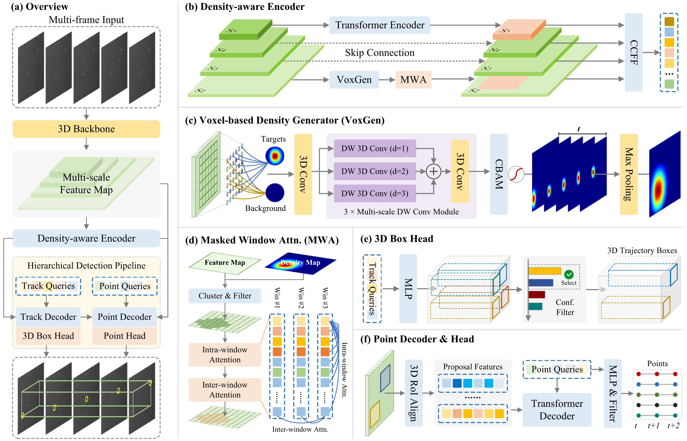

# Seeing Like a Falcon: Hierarchical Spatiotemporal Detection of Dim Moving Objects

FalconDet is a 3D spatiotemporal detector tailored for Dim Moving Objects.

## Model Architecture



## Installation

Run the commands below from the repository root.

1. Create and activate a conda environment:

```bash
conda create -n falcondet python=3.10 -y
conda activate falcondet
```

2. Install dependencies:

- PyTorch and torchvision (install builds that match your CUDA runtime if using GPU)
- CUDA (optional, required for GPU training)

After installing PyTorch and torchvision, install the remaining dependencies:

```bash
pip install -e pytorchvideo/facebookresearch_pytorchvideo_main
pip install numpy scipy tensorboard pyyaml opencv-python pillow tqdm
```

## Dataset Preparation

Download AstroDim from [Hugging Face](https://huggingface.co/datasets/CastleChen339/AstroDim).

Expected structure for AstroDim:

```
/home/cjc/datasets/
  AstroDim/
    train/
      <sequence_id>/
        images/
        json/
    val/
      <sequence_id>/
        images/
        json/
  AstroDim_mini/
    train/...
    val/...
```

Update dataset paths in [configs/custom/AstroDim_dataset.yml](configs/custom/AstroDim_dataset.yml) if needed.

## Training

```bash
python train.py -c configs/custom/FalconDet_train.yml
```

To resume from a checkpoint:

```bash
python train.py -c configs/custom/FalconDet_train.yml -r /path/to/checkpoint.pth
```

## Evaluation

```bash
python train.py -c configs/custom/FalconDet_eval.yml -r /path/to/checkpoint.pth --test-only
```

## Inference

Run inference on a sequence and save predictions and visualizations:

```bash
python inference.py \
  -c configs/custom/FalconDet_eval.yml \
  -r /path/to/checkpoint.pth \
  -s /path/to/testset \
  -o outputs/inference
```

`-o` / `--output` specifies an output directory. Predictions are saved to `outputs/inference/predictions.json`, and visualizations to `outputs/inference/visualizations/`. Replace `--source` with your sequence directory or a directory containing sequence directories.

## Citation

If you find this work useful, please cite:

```bibtex
@article{chen2026falcondet,
title = {FalconDet: A trajectory-aware spatiotemporal framework for dim moving object detection},
journal = {Pattern Recognition},
pages = {115037},
year = {2026},
issn = {0031-3203},
doi = {https://doi.org/10.1016/j.patcog.2026.115037},
url = {https://www.sciencedirect.com/science/article/pii/S0031320326020017},
author = {Jiuchen Chen and Xinyu Yan and Qizhi Xu and Xiaolin Han},
}
```

## Acknowledgement

Our work is built upon [D-FINE](https://github.com/Peterande/D-FINE). Thanks to the inspirations from [Dome-DETR](https://github.com/RicePasteM/Dome-DETR).

✨ Feel free to contribute and reach out if you have any questions! ✨
